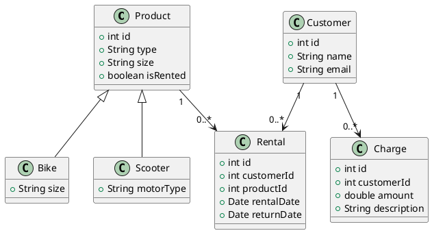
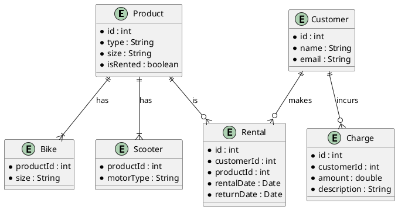
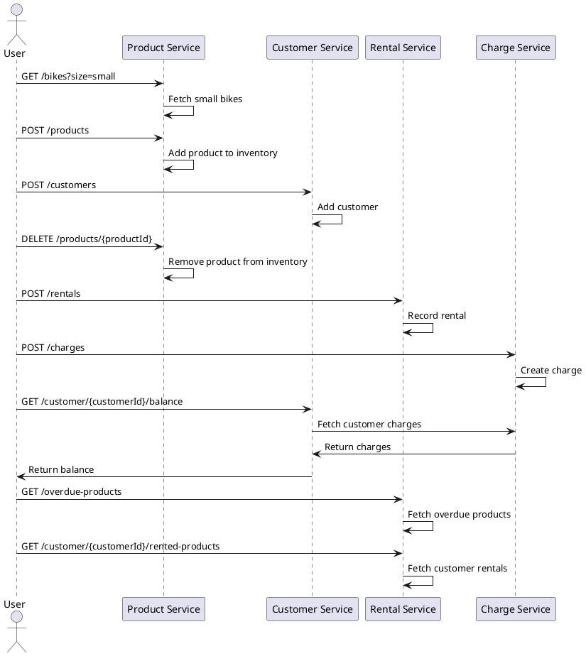

---

**Bike Rental Shop**

*Overview:*
You've been hired by a bike shop to create software to help them with their rental operation. This includes automating activities such as keeping track of inventory, customers, stock items that are rented, customer fee accrual, etc. The store rents two types of products: Bikes and Scooters. Each bike is made in one of three different sizes, Small, Medium, Large, and will fit small, medium, and large humans respectively. We’d like to be sure our customers get a bike that fits them and will need to track size of our bikes. The scooters are available in electric motor or gas motor styles. The styles of scooters are very different so we want to track them separately so we can match our customers' needs to the appropriate scooter.

*Required Queries:*
1. How many small bikes do you have?
2. What products are there for rent?
3. Does this customer have a balance? (aka owe us money)
4. What products are rented?
5. Are there products that are overdue for return? Who has them?
6. What products has a customer rented?

*Required Commands:*
1. Add a product to inventory
2. Add a customer
3. Remove a product from inventory (permanently not for rental, i.e., it’s been damaged)
4. Record that a product is rented to a customer
5. Create a charge for the customer

*Deliverables:*
- API spec
- Class diagrams
- Schema design
- Sequence diagram

---


Sure! Here is an example of how you can create an API spec, class diagrams, schema design, and sequence diagram using PlantUML.

### API Spec
We'll define some basic API endpoints for the required commands and queries.

```yaml
# API Spec
GET /bikes?size=small
GET /products
GET /customer/{customerId}/balance
GET /rented-products
GET /overdue-products
GET /customer/{customerId}/rented-products

POST /products
POST /customers
DELETE /products/{productId}
POST /rentals
POST /charges
```

### Class Diagrams



### Schema Design



### Sequence Diagram



These diagrams and specs represent a high-level design for the bike rental shop software system. Each part can be further detailed and adjusted as needed based on specific requirements and implementation details.

