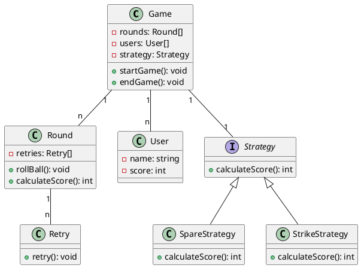

---

## Low-Level Design: Bowling Alley Game

### Problem Statement

**Description:**  
Design a system to simulate a bowling alley game where players' scores are maintained and shown by the system, and a winner is declared at the end of the game. Multiple games can be played in parallel on multiple free lanes.

**Rules:**
- A game consists of ten sets.
- In each set, the player has two opportunities to knock down ten pins.
- The score for a set is the total number of pins knocked down, plus bonuses for strikes and spares.
- A spare is when the player knocks down all ten pins in two tries. If there is a spare, the player gets 5 bonus points.
- A strike is when the player knocks down all ten pins on their first try. If there is a strike, the player gets 10 bonus points.
- In the final set, a player who rolls a spare or a strike is allowed to roll extra balls to complete the set. However, only a maximum of three balls can be rolled in the final set.

**Admin Configurations:**
- Number of parallel games
- Number of rounds in a single game
- Number of players in a game
- Player turn strategy (who will get the next chance to play)
- Scoring Strategy
- Number of retries per user in a Round (once fixed at the beginning of the game, should be fixed)

---

Here is a simplified example of a class diagram and a sequence diagram for the bowling alley game:

### Class Diagram

### Sequence Diagram

