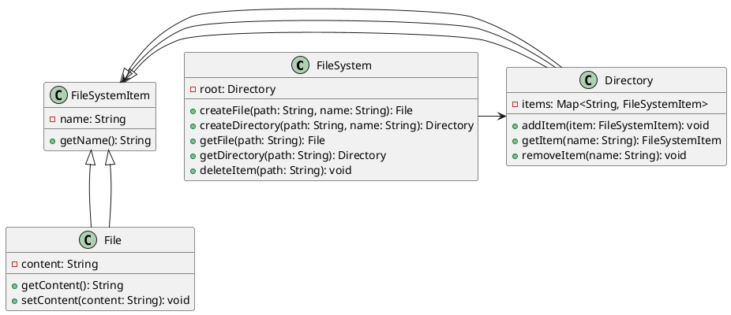
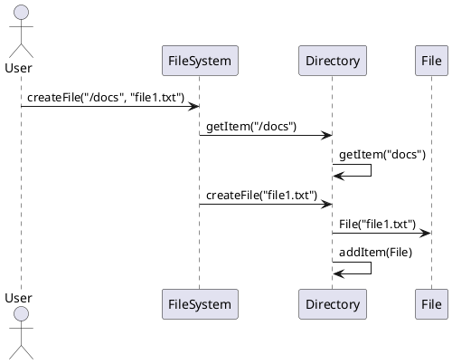

### Designing an in-memory file system

Designing an in-memory file system involves creating a structure that can simulate the functionality of a real file system, including directories, files, and operations such as creating, reading, and deleting files and directories. Let's start with the class diagram, followed by the sequence diagram, and finally, we'll implement the Java code.

### Class Diagram
We'll define the following classes for our in-memory file system:
1. `FileSystem` - The main class to interact with the file system.
2. `Directory` - Represents a directory in the file system.
3. `File` - Represents a file in the file system.
4. `FileSystemItem` - A base class for `File` and `Directory`.

### PlantUML Class Diagram


### Sequence Diagram
We'll create a sequence diagram for creating a file in the file system.

### PlantUML Sequence Diagram


### Java Code Implementation

```java
import java.util.*;

abstract class FileSystemItem {
    protected String name;

    public FileSystemItem(String name) {
        this.name = name;
    }

    public String getName() {
        return name;
    }
}

class File extends FileSystemItem {
    private String content;

    public File(String name) {
        super(name);
        this.content = "";
    }

    public String getContent() {
        return content;
    }

    public void setContent(String content) {
        this.content = content;
    }
}

class Directory extends FileSystemItem {
    private Map<String, FileSystemItem> items;

    public Directory(String name) {
        super(name);
        this.items = new HashMap<>();
    }

    public void addItem(FileSystemItem item) {
        items.put(item.getName(), item);
    }

    public FileSystemItem getItem(String name) {
        return items.get(name);
    }

    public void removeItem(String name) {
        items.remove(name);
    }
}

class FileSystem {
    private Directory root;

    public FileSystem() {
        root = new Directory("");
    }

    public File createFile(String path, String name) {
        Directory dir = navigateToDirectory(path);
        if (dir != null) {
            File file = new File(name);
            dir.addItem(file);
            return file;
        }
        return null;
    }

    public Directory createDirectory(String path, String name) {
        Directory dir = navigateToDirectory(path);
        if (dir != null) {
            Directory newDir = new Directory(name);
            dir.addItem(newDir);
            return newDir;
        }
        return null;
    }

    public File getFile(String path) {
        FileSystemItem item = navigateToItem(path);
        if (item instanceof File) {
            return (File) item;
        }
        return null;
    }

    public Directory getDirectory(String path) {
        FileSystemItem item = navigateToItem(path);
        if (item instanceof Directory) {
            return (Directory) item;
        }
        return null;
    }

    public void deleteItem(String path) {
        int lastSlashIndex = path.lastIndexOf('/');
        if (lastSlashIndex == -1) {
            return;
        }
        String parentPath = path.substring(0, lastSlashIndex);
        String itemName = path.substring(lastSlashIndex + 1);
        Directory parentDir = navigateToDirectory(parentPath);
        if (parentDir != null) {
            parentDir.removeItem(itemName);
        }
    }

    private FileSystemItem navigateToItem(String path) {
        String[] parts = path.split("/");
        Directory current = root;
        for (String part : parts) {
            if (part.isEmpty()) continue;
            FileSystemItem item = current.getItem(part);
            if (item instanceof Directory) {
                current = (Directory) item;
            } else {
                return item;
            }
        }
        return current;
    }

    private Directory navigateToDirectory(String path) {
        FileSystemItem item = navigateToItem(path);
        if (item instanceof Directory) {
            return (Directory) item;
        }
        return null;
    }
}

public class Main {
    public static void main(String[] args) {
        FileSystem fs = new FileSystem();
        fs.createDirectory("/", "docs");
        File file = fs.createFile("/docs", "file1.txt");
        file.setContent("Hello, World!");
        
        File fetchedFile = fs.getFile("/docs/file1.txt");
        if (fetchedFile != null) {
            System.out.println(fetchedFile.getContent());  // Output: Hello, World!
        }
        
        fs.deleteItem("/docs/file1.txt");
        System.out.println(fs.getFile("/docs/file1.txt"));  // Output: null
    }
}
```

This code represents a simple in-memory file system with basic operations like creating, reading, and deleting files and directories. The `FileSystem` class provides an interface to interact with the file system, and the `Directory` and `File` classes represent the directories and files respectively.