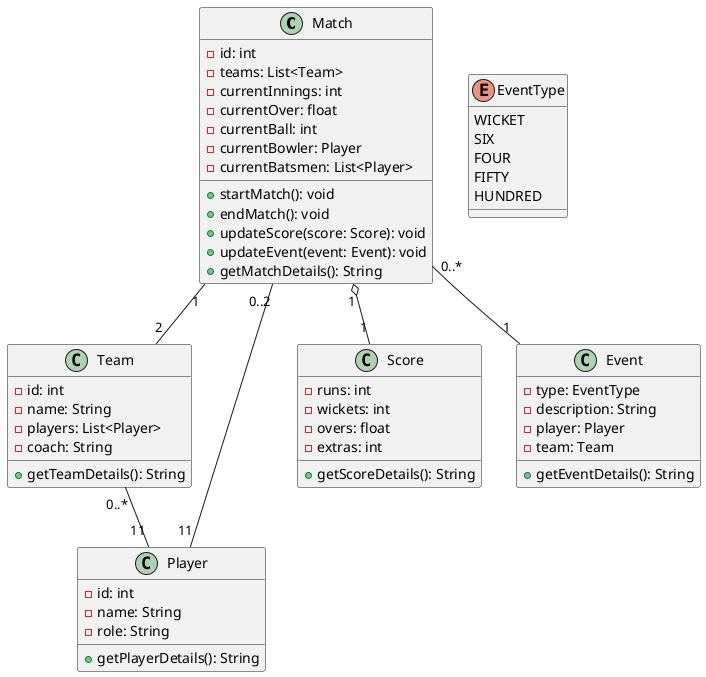
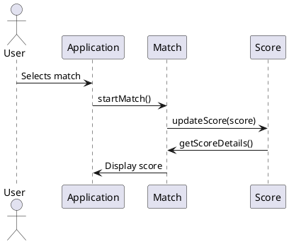

### LLD: Design CriccBuzz

**Problem Statement:**

Design and implement a live cricket statistics application that provides real-time updates on cricket matches. The application should display live scores, ball-by-ball updates, player statistics, team information, and match commentary. Users should be able to select matches of interest and receive notifications for key events such as wickets, boundaries, and milestones.

**Class Diagram:**



**Sequence Diagram (Update Score):**



Sure, here's a simplified version of the Java code implementing the classes described in the class diagram along with a `main` method to demonstrate how they could be used:

```java
import java.util.ArrayList;
import java.util.List;

// Enum for event types
enum EventType {
    WICKET,
    SIX,
    FOUR,
    FIFTY,
    HUNDRED
}

// Player class representing a cricket player
class Player {
    private int id;
    private String name;
    private String role;

    public Player(int id, String name, String role) {
        this.id = id;
        this.name = name;
        this.role = role;
    }

    public String getPlayerDetails() {
        return name + " (" + role + ")";
    }
}

// Team class representing a cricket team
class Team {
    private int id;
    private String name;
    private List<Player> players;

    public Team(int id, String name) {
        this.id = id;
        this.name = name;
        this.players = new ArrayList<>();
    }

    public void addPlayer(Player player) {
        players.add(player);
    }

    public String getTeamDetails() {
        StringBuilder details = new StringBuilder();
        details.append("Team: ").append(name).append("\n");
        details.append("Players:\n");
        for (Player player : players) {
            details.append("- ").append(player.getPlayerDetails()).append("\n");
        }
        return details.toString();
    }
}

// Score class representing the score of a cricket match
class Score {
    private int runs;
    private int wickets;
    private float overs;
    private int extras;

    public Score(int runs, int wickets, float overs, int extras) {
        this.runs = runs;
        this.wickets = wickets;
        this.overs = overs;
        this.extras = extras;
    }

    public String getScoreDetails() {
        return "Score: " + runs + "/" + wickets + " (" + overs + " overs)";
    }
}

// Event class representing a cricket event (e.g., wicket, six, four)
class Event {
    private EventType type;
    private String description;
    private Player player;
    private Team team;

    public Event(EventType type, String description, Player player, Team team) {
        this.type = type;
        this.description = description;
        this.player = player;
        this.team = team;
    }

    public String getEventDetails() {
        return description + " - " + player.getPlayerDetails() + " - " + team.getTeamDetails();
    }
}

// Match class representing a cricket match
class Match {
    private int id;
    private List<Team> teams;
    private int currentInnings;
    private float currentOver;
    private int currentBall;
    private Player currentBowler;
    private List<Player> currentBatsmen;
    private Score score;
    private List<Event> events;

    public Match(int id) {
        this.id = id;
        this.teams = new ArrayList<>();
        this.currentBatsmen = new ArrayList<>();
        this.events = new ArrayList<>();
    }

    public void startMatch() {
        // Initialize match parameters
    }

    public void endMatch() {
        // End the match
    }

    public void updateScore(Score score) {
        this.score = score;
    }

    public void updateEvent(Event event) {
        events.add(event);
    }

    public String getMatchDetails() {
        StringBuilder details = new StringBuilder();
        details.append("Match ID: ").append(id).append("\n");
        details.append("Teams:\n");
        for (Team team : teams) {
            details.append(team.getTeamDetails()).append("\n");
        }
        if (score != null) {
            details.append(score.getScoreDetails()).append("\n");
        }
        return details.toString();
    }
}

public class CricketApp {
    public static void main(String[] args) {
        // Creating players
        Player player1 = new Player(1, "Virat Kohli", "Batsman");
        Player player2 = new Player(2, "Jasprit Bumrah", "Bowler");

        // Creating teams and adding players
        Team team1 = new Team(1, "India");
        team1.addPlayer(player1);
        Team team2 = new Team(2, "Australia");
        team2.addPlayer(player2);

        // Creating a match
        Match match = new Match(123);
        match.startMatch();

        // Simulating score update
        Score score = new Score(100, 2, 15.3f, 5);
        match.updateScore(score);

        // Simulating an event
        Event event = new Event(EventType.WICKET, "Virat Kohli out", player1, team1);
        match.updateEvent(event);

        // Displaying match details
        System.out.println(match.getMatchDetails());
    }
}
```

This code provides a basic structure for the cricket application, including classes for players, teams, matches, scores, and events. The `main` method demonstrates how to create instances of these classes and simulate a match with score updates and events.