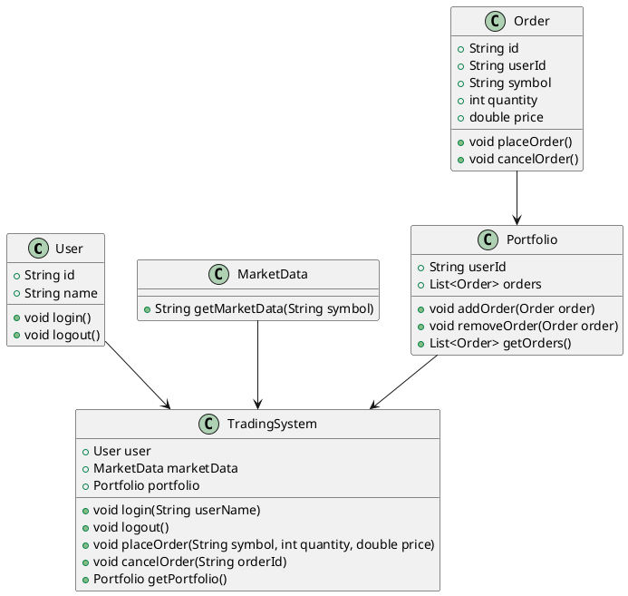
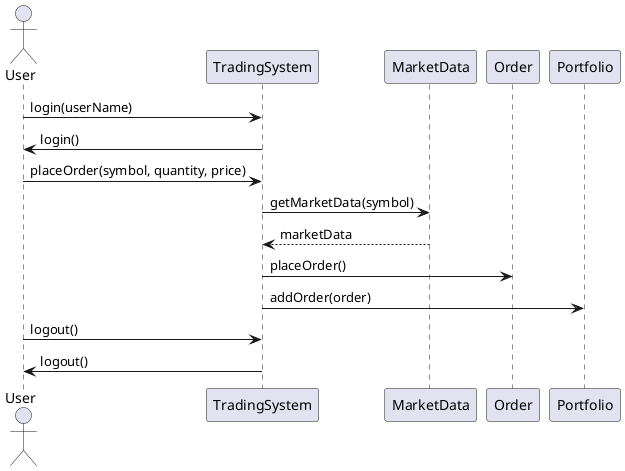

## Low-Level Design: Zerodha


Designing a trading system like Zerodha involves creating several components such as user authentication, market data retrieval, order management, portfolio management, and reporting.


### Key Components
1. **User**: Represents the user of the system.
2. **MarketData**: Retrieves market data.
3. **Order**: Represents an order placed by the user.
4. **Portfolio**: Manages the user's portfolio.
5. **TradingSystem**: Central system that coordinates between different components.


### Java Classes

#### User Class

```java
import java.util.UUID;

public class User {
    private String id;
    private String name;

    public User(String name) {
        this.id = UUID.randomUUID().toString();
        this.name = name;
    }

    public String getId() {
        return id;
    }

    public String getName() {
        return name;
    }

    public void login() {
        System.out.println(name + " logged in.");
    }

    public void logout() {
        System.out.println(name + " logged out.");
    }
}
```

#### MarketData Class

```java
public class MarketData {
    public String getMarketData(String symbol) {
        // Simulated market data retrieval
        return "Market data for " + symbol;
    }
}
```

#### Order Class

```java
import java.util.UUID;

public class Order {
    private String id;
    private String userId;
    private String symbol;
    private int quantity;
    private double price;

    public Order(String userId, String symbol, int quantity, double price) {
        this.id = UUID.randomUUID().toString();
        this.userId = userId;
        this.symbol = symbol;
        this.quantity = quantity;
        this.price = price;
    }

    public String getId() {
        return id;
    }

    public String getUserId() {
        return userId;
    }

    public String getSymbol() {
        return symbol;
    }

    public int getQuantity() {
        return quantity;
    }

    public double getPrice() {
        return price;
    }

    public void placeOrder() {
        System.out.println("Order placed: " + quantity + " shares of " + symbol + " at $" + price);
    }

    public void cancelOrder() {
        System.out.println("Order cancelled: " + id);
    }
}
```

#### Portfolio Class

```java
import java.util.ArrayList;
import java.util.List;

public class Portfolio {
    private String userId;
    private List<Order> orders;

    public Portfolio(String userId) {
        this.userId = userId;
        this.orders = new ArrayList<>();
    }

    public void addOrder(Order order) {
        orders.add(order);
        System.out.println("Order added to portfolio: " + order.getId());
    }

    public void removeOrder(Order order) {
        orders.remove(order);
        System.out.println("Order removed from portfolio: " + order.getId());
    }

    public List<Order> getOrders() {
        return orders;
    }
}
```

#### TradingSystem Class

```java
public class TradingSystem {
    private User user;
    private MarketData marketData = new MarketData();
    private Portfolio portfolio;

    public void login(String userName) {
        user = new User(userName);
        user.login();
        portfolio = new Portfolio(user.getId());
    }

    public void logout() {
        user.logout();
        user = null;
        portfolio = null;
    }

    public void placeOrder(String symbol, int quantity, double price) {
        if (user == null) {
            System.out.println("User not logged in.");
            return;
        }
        String marketDataInfo = marketData.getMarketData(symbol);
        System.out.println(marketDataInfo);
        Order order = new Order(user.getId(), symbol, quantity, price);
        order.placeOrder();
        portfolio.addOrder(order);
    }

    public void cancelOrder(String orderId) {
        if (user == null) {
            System.out.println("User not logged in.");
            return;
        }
        List<Order> orders = portfolio.getOrders();
        for (Order order : orders) {
            if (order.getId().equals(orderId)) {
                order.cancelOrder();
                portfolio.removeOrder(order);
                return;
            }
        }
        System.out.println("Order not found: " + orderId);
    }
}
```

### Main Class

Here's a main class to demonstrate the usage of the trading system:

```java
public class Main {
    public static void main(String[] args) {
        TradingSystem tradingSystem = new TradingSystem();

        // User login
        tradingSystem.login("Alice");

        // Place an order
        tradingSystem.placeOrder("AAPL", 10, 150.0);

        // Place another order
        tradingSystem.placeOrder("GOOGL", 5, 2800.0);

        // Cancel an order
        List<Order> orders = tradingSystem.getPortfolio().getOrders();
        if (!orders.isEmpty()) {
            tradingSystem.cancelOrder(orders.get(0).getId());
        }

        // User logout
        tradingSystem.logout();
    }
}
```

### Full Code with PlantUML

To create PlantUML diagrams, you can use the following PlantUML code.

#### Class Diagram



#### Sequence Diagram



### Conclusion

This code provides a basic, functional trading system with user authentication, order placement, and portfolio management. The diagrams and code can be expanded to include more features and handle real-world complexities such as error handling, data persistence, and integration with external services.