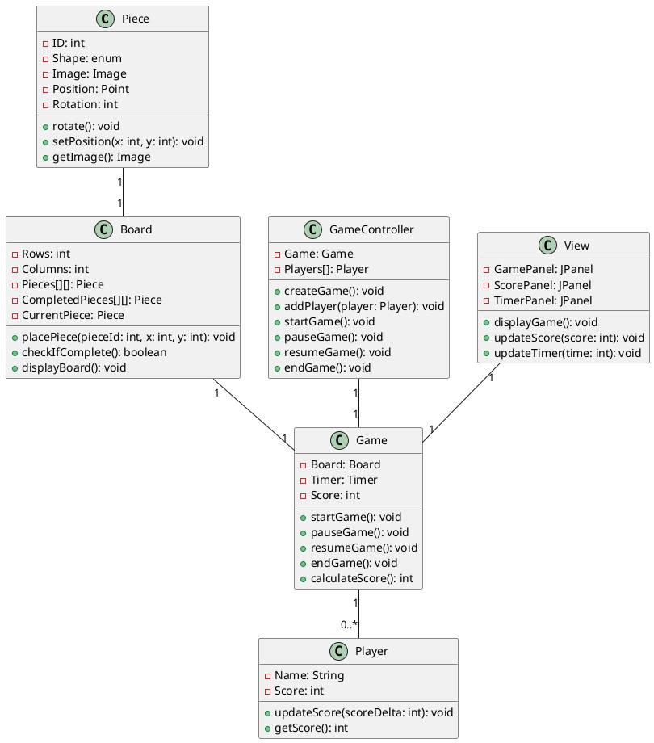

### Problem Statement: Jigsaw Puzzle Low-Level Design

You are tasked with designing the low-level components for a Jigsaw Puzzle game. The game should allow players to solve jigsaw puzzles by assembling various pieces to form a complete picture.

### Requirements:

1. **Piece Class**:
    - Define a class to represent a puzzle piece.
    - Properties: ID, Shape (enum), Image (optional), Position (x, y), Rotation (0-360 degrees).
    - Methods: rotate(), setPosition(x, y), getImage().

2. **Board Class**:
    - Define a class to represent the game board.
    - Properties: Rows, Columns, Pieces[][], CompletedPieces[][], CurrentPiece.
    - Methods: placePiece(pieceId, x, y), checkIfComplete(), displayBoard().

3. **Game Class**:
    - Define a class to manage the game state.
    - Properties: Board, Timer, Score.
    - Methods: startGame(), pauseGame(), resumeGame(), endGame(), calculateScore().

4. **Player Class**:
    - Define a class to represent a player.
    - Properties: Name, Score.
    - Methods: updateScore(), getScore().

5. **GameController Class**:
    - Define a class to control the flow of the game.
    - Properties: Game, Players[].
    - Methods: createGame(), addPlayer(player), startGame(), pauseGame(), resumeGame(), endGame().

6. **View Class**:
    - Define a class to manage the graphical user interface.
    - Properties: GamePanel, ScorePanel, TimerPanel.
    - Methods: displayGame(), updateScore(), updateTimer().

7. **Main Class**:
    - Define a main class to start the game.

### Expectations:

- Implement the above classes with appropriate properties and methods.
- Ensure that the classes interact correctly to manage the game state, player actions, and the display of the puzzle.
- Consider additional features or improvements to enhance the game experience (optional).

Here's a basic example of how you might implement the classes and a sequence diagram for a Jigsaw Puzzle game using PlantUML. Note that this is a simplified example and may need to be adapted based on your specific requirements.

### Class Diagram:

### Sequence Diagram :

This is a basic outline and may need to be expanded or modified based on the specific requirements and interactions of your game.