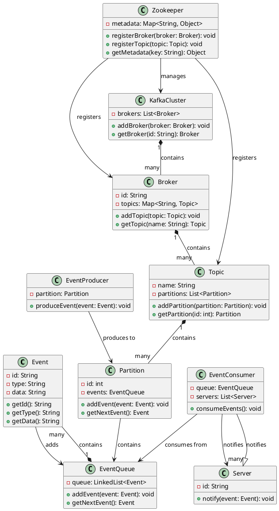
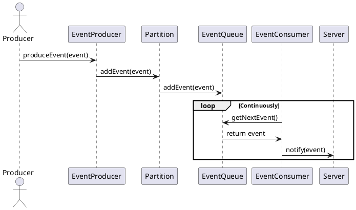

## Low-Level Design: Kafka

To design a system to notify events to multiple servers, similar to Kafka, we'll follow these steps:

### Extended Core Components

1. **KafkaCluster**: Manages the overall Kafka cluster.
2. **Broker**: Represents a Kafka broker within the cluster.
3. **Topic**: Represents a topic that events are published to.
4. **Partition**: Represents a partition within a topic.
5. **Zookeeper**: Manages the metadata for the Kafka cluster.

### Class Diagram

Here's the extended class diagram to represent these components:

Here's the extended class diagram, including Kafka cluster, broker, topic, partition, and Zookeeper components:

This class diagram includes:

- **Event**: Represents an event to be notified.
- **EventQueue**: Manages the queue of events to be dispatched.
- **EventProducer**: Produces events and sends them to a specific partition.
- **EventConsumer**: Consumes events from the event queue and notifies servers.
- **Server**: Represents a server that will receive notifications.
- **KafkaCluster**: Manages the overall Kafka cluster.
- **Broker**: Represents a Kafka broker within the cluster.
- **Topic**: Represents a topic that events are published to.
- **Partition**: Represents a partition within a topic.
- **Zookeeper**: Manages the metadata for the Kafka cluster.

### Sequence Diagram

Here's the sequence diagram showing the interactions including Kafka components:

[Full Code](https://github.com/meghnadsaha/practice-low-level-design/tree/master/src/com/lld/medium/kafka)

### Class Diagram

### Activity Diagram

