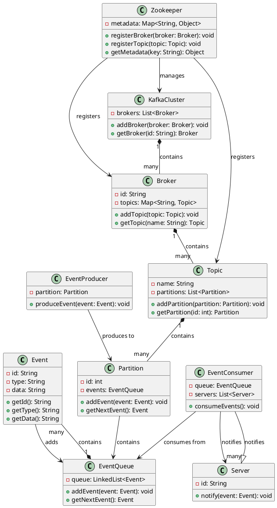
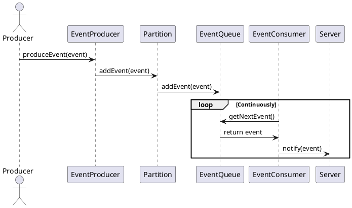

To design a system to notify events to multiple servers, similar to Kafka, we'll follow these steps:


### Extended Core Components

1. **KafkaCluster**: Manages the overall Kafka cluster.
2. **Broker**: Represents a Kafka broker within the cluster.
3. **Topic**: Represents a topic that events are published to.
4. **Partition**: Represents a partition within a topic.
5. **Zookeeper**: Manages the metadata for the Kafka cluster.

### Class Diagram

Here's the extended class diagram to represent these components:

Here's the extended class diagram, including Kafka cluster, broker, topic, partition, and Zookeeper components:



This class diagram includes:

- **Event**: Represents an event to be notified.
- **EventQueue**: Manages the queue of events to be dispatched.
- **EventProducer**: Produces events and sends them to a specific partition.
- **EventConsumer**: Consumes events from the event queue and notifies servers.
- **Server**: Represents a server that will receive notifications.
- **KafkaCluster**: Manages the overall Kafka cluster.
- **Broker**: Represents a Kafka broker within the cluster.
- **Topic**: Represents a topic that events are published to.
- **Partition**: Represents a partition within a topic.
- **Zookeeper**: Manages the metadata for the Kafka cluster.

### Sequence Diagram

Here's the sequence diagram showing the interactions including Kafka components:



### Java Code Implementation

Here’s a simple Java implementation for the extended components:

```java
import java.util.*;

class Event {
    private String id;
    private String type;
    private String data;

    public Event(String id, String type, String data) {
        this.id = id;
        this.type = type;
        this.data = data;
    }

    public String getId() {
        return id;
    }

    public String getType() {
        return type;
    }

    public String getData() {
        return data;
    }
}

class EventQueue {
    private LinkedList<Event> queue = new LinkedList<>();

    public synchronized void addEvent(Event event) {
        queue.add(event);
        notifyAll();
    }

    public synchronized Event getNextEvent() {
        while (queue.isEmpty()) {
            try {
                wait();
            } catch (InterruptedException e) {
                Thread.currentThread().interrupt();
            }
        }
        return queue.poll();
    }
}

class EventProducer {
    private Partition partition;

    public EventProducer(Partition partition) {
        this.partition = partition;
    }

    public void produceEvent(Event event) {
        partition.addEvent(event);
    }
}

class EventConsumer {
    private EventQueue queue;
    private List<Server> servers;

    public EventConsumer(EventQueue queue, List<Server> servers) {
        this.queue = queue;
        this.servers = servers;
    }

    public void consumeEvents() {
        while (true) {
            Event event = queue.getNextEvent();
            for (Server server : servers) {
                server.notify(event);
            }
        }
    }
}

class Server {
    private String id;

    public Server(String id) {
        this.id = id;
    }

    public void notify(Event event) {
        System.out.println("Server " + id + " notified of event: " + event.getId());
    }
}

class Partition {
    private int id;
    private EventQueue events = new EventQueue();

    public Partition(int id) {
        this.id = id;
    }

    public void addEvent(Event event) {
        events.addEvent(event);
    }

    public Event getNextEvent() {
        return events.getNextEvent();
    }
}

class Topic {
    private String name;
    private List<Partition> partitions = new ArrayList<>();

    public Topic(String name) {
        this.name = name;
    }

    public void addPartition(Partition partition) {
        partitions.add(partition);
    }

    public Partition getPartition(int id) {
        return partitions.get(id);
    }
}

class Broker {
    private String id;
    private Map<String, Topic> topics = new HashMap<>();

    public Broker(String id) {
        this.id = id;
    }

    public void addTopic(Topic topic) {
        topics.put(topic.name, topic);
    }

    public Topic getTopic(String name) {
        return topics.get(name);
    }
}

class KafkaCluster {
    private List<Broker> brokers = new ArrayList<>();

    public void addBroker(Broker broker) {
        brokers.add(broker);
    }

    public Broker getBroker(String id) {
        for (Broker broker : brokers) {
            if (broker.id.equals(id)) {
                return broker;
            }
        }
        return null;
    }
}

class Zookeeper {
    private Map<String, Object> metadata = new HashMap<>();

    public void registerBroker(Broker broker) {
        metadata.put("broker-" + broker.id, broker);
    }

    public void registerTopic(Topic topic) {
        metadata.put("topic-" + topic.name, topic);
    }

    public Object getMetadata(String key) {
        return metadata.get(key);
    }
}

public class Main {
    public static void main(String[] args) {
        KafkaCluster cluster = new KafkaCluster();
        Zookeeper zookeeper = new Zookeeper();

        Broker broker1 = new Broker("broker1");
        Broker broker2 = new Broker("broker2");

        cluster.addBroker(broker1);
        cluster.addBroker(broker2);

        zookeeper.registerBroker(broker1);
        zookeeper.registerBroker(broker2);

        Topic topic = new Topic("topic1");
        Partition partition1 = new Partition(0);
        Partition partition2 = new Partition(1);

        topic.addPartition(partition1);
        topic.addPartition(partition2);

        broker1.addTopic(topic);
        zookeeper.registerTopic(topic);

        EventProducer producer = new EventProducer(partition1);
        EventConsumer consumer = new EventConsumer(partition1.events, List.of(new Server("Server1"), new Server("Server2")));

        // Start consumer in a new thread
        new Thread(consumer::consumeEvents).start();

        // Produce some events
        producer.produceEvent(new Event("1", "type1", "data1"));
        producer.produceEvent(new Event("2", "type2", "data2"));
    }
}
```

This design includes the Kafka-like components and shows how they can be interconnected. The `KafkaCluster` manages multiple `Broker` instances, each of which can manage multiple `Topic` instances, and each `Topic` can have multiple `Partition` instances. The `Zookeeper` manages metadata for the cluster, brokers, and topics. The `EventProducer` produces events to a specific `Partition`, and the `EventConsumer` consumes events from the `Partition` and notifies the servers.

[Full Code](https://github.com/meghnadsaha/practice-low-level-design/tree/master/src/com/lld/medium/kafka)


### Class Diagram


### Activity Diagram

