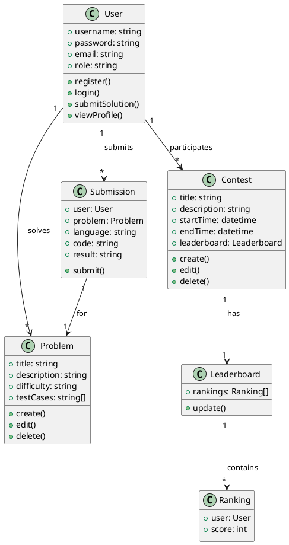
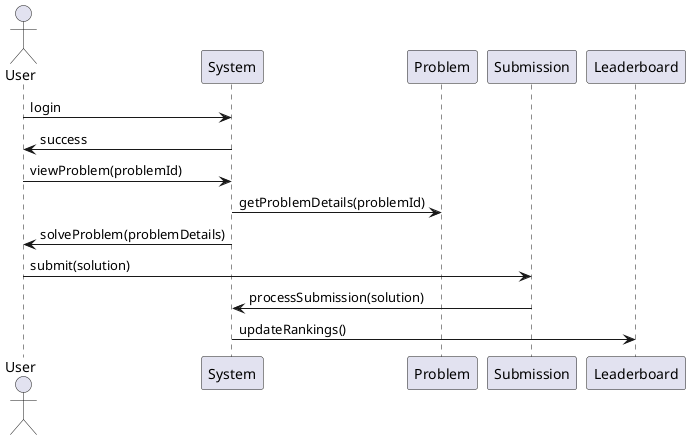

**Design a LeetCode-Like System**

**High-Level Requirements:**
1. Users can solve problems individually.
2. Users can participate in contests.
3. System should show leaderboard for contests.
4. Users can submit their solutions for problems and contests.
5. System should support multiple languages for solutions.
6. System should handle user authentication and authorization.
7. System should track user progress and submissions.
8. System should support creating, editing, and deleting problems and contests.
9. System should provide an interface for users to view problems and contests.

**Classes and Interfaces:**
1. **User:** Represents a user of the system. Contains information such as username, password, email, and role.
2. **Problem:** Represents a problem that users can solve. Contains information such as title, description, difficulty level, and test cases.
3. **Contest:** Represents a contest that users can participate in. Contains information such as title, description, start time, end time, and leaderboard.
4. **Submission:** Represents a user's submission for a problem or contest. Contains information such as user, problem/contest, language, code, and result.
5. **Leaderboard:** Represents the leaderboard for a contest. Contains information such as rank, user, score, and submission time.

**Low-Level Design Expectations:**
1. **User Authentication and Authorization:** Use a secure authentication mechanism like JWT. Define roles (admin, user) and permissions (create, edit, delete problems/contests) for users.
2. **Problem and Contest Creation:** Implement functionality for admins to create, edit, and delete problems and contests.
3. **Submission Handling:** Implement a submission processing system that compiles and executes user code. Use sandboxing techniques to ensure security and prevent malicious code execution. Support multiple languages (Java, C++, Python, etc.) using language-specific compilers or interpreters.
4. **Leaderboard Generation:** Implement a mechanism to calculate and update the leaderboard based on user submissions and scores.
5. **User Progress Tracking:** Track user progress, submissions, and scores for problems and contests. Display this information in user profiles.
6. **Contest Participation:** Allow users to register for contests and submit solutions during the contest duration. Display real-time rankings during the contest.
7. **Code Execution Parameters:** When implementing the user code execution algorithm, consider parameters such as timeout (maximum execution time), memory limit, input/output redirection, and error handling (e.g., compile-time errors, runtime errors). Use containerization (e.g., Docker) for isolation and resource management.

Here's a basic example of class and sequence diagrams using PlantUML for a simplified version of the LeetCode-like system:

**Class Diagram:**

**Sequence Diagram (User solving a problem):**

These diagrams provide a basic structure for a system where users can solve problems, participate in contests, and submit their solutions.