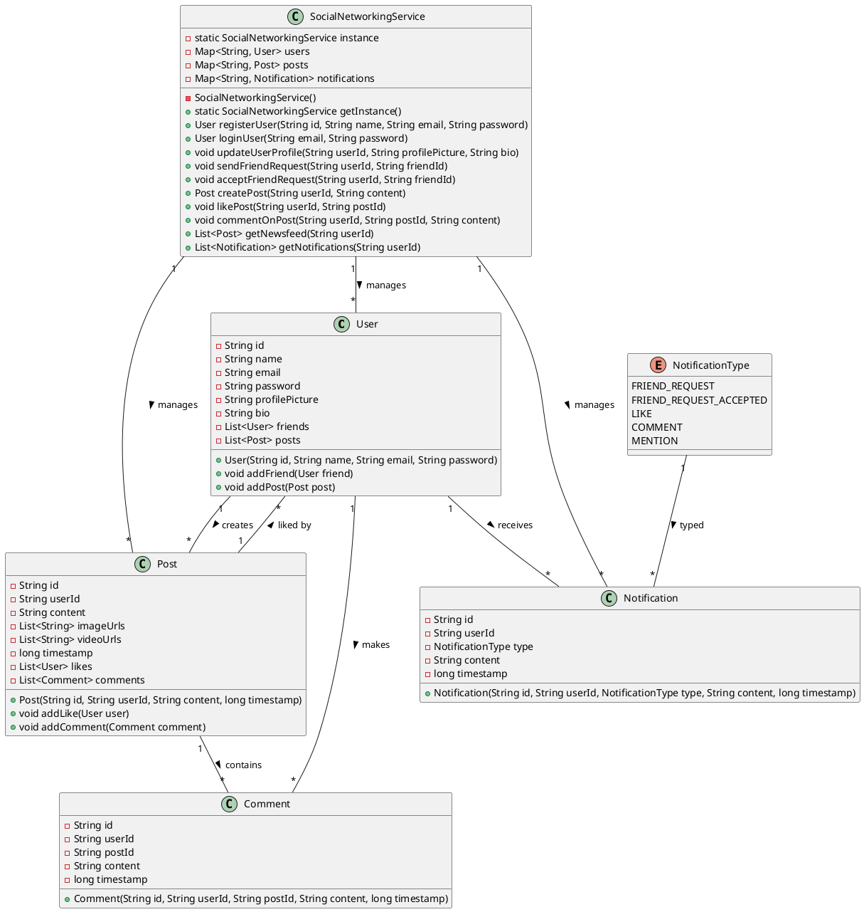
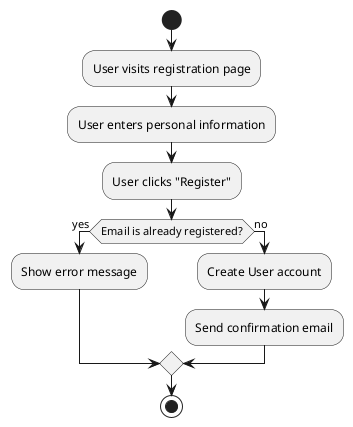
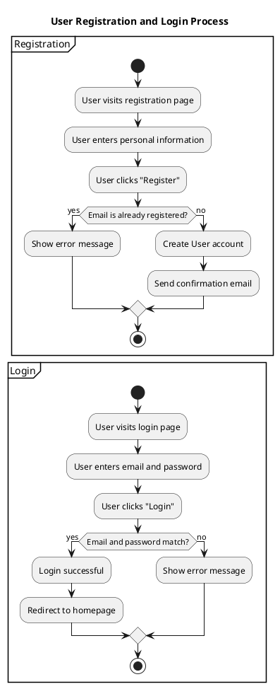

Here's a high-level design for a social network like Facebook implemented in Java. This design will include key classes, their properties, and methods, following the requirements you provided. We'll use in-memory data structures for simplicity, but for a real application, you would use a database and additional technologies.

### Key Classes and Data Structures

1. **User Class**
2. **Post Class**
3. **Comment Class**
4. **Notification Class**
5. **NotificationType Enum**
6. **SocialNetworkingService Class**
7. **SocialNetworkingDemo Class**

### User Class

```java
import java.util.List;
import java.util.concurrent.CopyOnWriteArrayList;

public class User {
    private String id;
    private String name;
    private String email;
    private String password;
    private String profilePicture;
    private String bio;
    private List<User> friends;
    private List<Post> posts;

    public User(String id, String name, String email, String password) {
        this.id = id;
        this.name = name;
        this.email = email;
        this.password = password;
        this.friends = new CopyOnWriteArrayList<>();
        this.posts = new CopyOnWriteArrayList<>();
    }

    // Getters and setters omitted for brevity

    public void addFriend(User friend) {
        friends.add(friend);
    }

    public void addPost(Post post) {
        posts.add(post);
    }
}
```

### Post Class

```java
import java.util.List;
import java.util.concurrent.CopyOnWriteArrayList;

public class Post {
    private String id;
    private String userId;
    private String content;
    private List<String> imageUrls;
    private List<String> videoUrls;
    private long timestamp;
    private List<User> likes;
    private List<Comment> comments;

    public Post(String id, String userId, String content, long timestamp) {
        this.id = id;
        this.userId = userId;
        this.content = content;
        this.timestamp = timestamp;
        this.likes = new CopyOnWriteArrayList<>();
        this.comments = new CopyOnWriteArrayList<>();
    }

    // Getters and setters omitted for brevity

    public void addLike(User user) {
        likes.add(user);
    }

    public void addComment(Comment comment) {
        comments.add(comment);
    }
}
```

### Comment Class

```java
public class Comment {
    private String id;
    private String userId;
    private String postId;
    private String content;
    private long timestamp;

    public Comment(String id, String userId, String postId, String content, long timestamp) {
        this.id = id;
        this.userId = userId;
        this.postId = postId;
        this.content = content;
        this.timestamp = timestamp;
    }

    // Getters and setters omitted for brevity
}
```

### Notification Class

```java
public class Notification {
    private String id;
    private String userId;
    private NotificationType type;
    private String content;
    private long timestamp;

    public Notification(String id, String userId, NotificationType type, String content, long timestamp) {
        this.id = id;
        this.userId = userId;
        this.type = type;
        this.content = content;
        this.timestamp = timestamp;
    }

    // Getters and setters omitted for brevity
}
```

### NotificationType Enum

```java
public enum NotificationType {
    FRIEND_REQUEST,
    FRIEND_REQUEST_ACCEPTED,
    LIKE,
    COMMENT,
    MENTION
}
```

### SocialNetworkingService Class

```java
import java.util.Map;
import java.util.concurrent.ConcurrentHashMap;

public class SocialNetworkingService {
    private static SocialNetworkingService instance;
    private Map<String, User> users;
    private Map<String, Post> posts;
    private Map<String, Notification> notifications;

    private SocialNetworkingService() {
        users = new ConcurrentHashMap<>();
        posts = new ConcurrentHashMap<>();
        notifications = new ConcurrentHashMap<>();
    }

    public static synchronized SocialNetworkingService getInstance() {
        if (instance == null) {
            instance = new SocialNetworkingService();
        }
        return instance;
    }

    public User registerUser(String id, String name, String email, String password) {
        User user = new User(id, name, email, password);
        users.put(id, user);
        return user;
    }

    public User loginUser(String email, String password) {
        for (User user : users.values()) {
            if (user.getEmail().equals(email) && user.getPassword().equals(password)) {
                return user;
            }
        }
        return null;
    }

    public void updateUserProfile(String userId, String profilePicture, String bio) {
        User user = users.get(userId);
        if (user != null) {
            user.setProfilePicture(profilePicture);
            user.setBio(bio);
        }
    }

    public void sendFriendRequest(String userId, String friendId) {
        User user = users.get(userId);
        User friend = users.get(friendId);
        if (user != null && friend != null) {
            // Assuming a simple notification for friend request
            Notification notification = new Notification(generateId(), friendId, NotificationType.FRIEND_REQUEST, user.getName() + " sent you a friend request", System.currentTimeMillis());
            notifications.put(notification.getId(), notification);
        }
    }

    public void acceptFriendRequest(String userId, String friendId) {
        User user = users.get(userId);
        User friend = users.get(friendId);
        if (user != null && friend != null) {
            user.addFriend(friend);
            friend.addFriend(user);
            // Notify friend request accepted
            Notification notification = new Notification(generateId(), friendId, NotificationType.FRIEND_REQUEST_ACCEPTED, user.getName() + " accepted your friend request", System.currentTimeMillis());
            notifications.put(notification.getId(), notification);
        }
    }

    public Post createPost(String userId, String content) {
        Post post = new Post(generateId(), userId, content, System.currentTimeMillis());
        posts.put(post.getId(), post);
        users.get(userId).addPost(post);
        return post;
    }

    public void likePost(String userId, String postId) {
        Post post = posts.get(postId);
        if (post != null) {
            post.addLike(users.get(userId));
            Notification notification = new Notification(generateId(), post.getUserId(), NotificationType.LIKE, users.get(userId).getName() + " liked your post", System.currentTimeMillis());
            notifications.put(notification.getId(), notification);
        }
    }

    public void commentOnPost(String userId, String postId, String content) {
        Post post = posts.get(postId);
        if (post != null) {
            Comment comment = new Comment(generateId(), userId, postId, content, System.currentTimeMillis());
            post.addComment(comment);
            Notification notification = new Notification(generateId(), post.getUserId(), NotificationType.COMMENT, users.get(userId).getName() + " commented on your post", System.currentTimeMillis());
            notifications.put(notification.getId(), notification);
        }
    }

    public List<Post> getNewsfeed(String userId) {
        User user = users.get(userId);
        List<Post> newsfeed = new CopyOnWriteArrayList<>();
        if (user != null) {
            for (User friend : user.getFriends()) {
                newsfeed.addAll(friend.getPosts());
            }
            newsfeed.addAll(user.getPosts());
            newsfeed.sort((p1, p2) -> Long.compare(p2.getTimestamp(), p1.getTimestamp()));
        }
        return newsfeed;
    }

    public List<Notification> getNotifications(String userId) {
        List<Notification> userNotifications = new CopyOnWriteArrayList<>();
        for (Notification notification : notifications.values()) {
            if (notification.getUserId().equals(userId)) {
                userNotifications.add(notification);
            }
        }
        return userNotifications;
    }

    private String generateId() {
        return String.valueOf(System.currentTimeMillis());
    }
}
```

### SocialNetworkingDemo Class

```java
public class SocialNetworkingDemo {
    public static void main(String[] args) {
        SocialNetworkingService service = SocialNetworkingService.getInstance();

        // Register users
        User alice = service.registerUser("1", "Alice", "alice@example.com", "password");
        User bob = service.registerUser("2", "Bob", "bob@example.com", "password");

        // Login users
        User loggedInAlice = service.loginUser("alice@example.com", "password");
        User loggedInBob = service.loginUser("bob@example.com", "password");

        // Update profile
        service.updateUserProfile(alice.getId(), "profile_pic_alice.jpg", "Bio for Alice");

        // Send friend request
        service.sendFriendRequest(alice.getId(), bob.getId());

        // Accept friend request
        service.acceptFriendRequest(bob.getId(), alice.getId());

        // Create post
        Post alicePost = service.createPost(alice.getId(), "Hello world!");

        // Like post
        service.likePost(bob.getId(), alicePost.getId());

        // Comment on post
        service.commentOnPost(bob.getId(), alicePost.getId(), "Nice post!");

        // Get newsfeed
        List<Post> aliceNewsfeed = service.getNewsfeed(alice.getId());
        System.out.println("Alice's Newsfeed:");
        for (Post post : aliceNewsfeed) {
            System.out.println(post.getContent());
        }

        // Get notifications
        List<Notification> aliceNotifications = service.getNotifications(alice.getId());
        System.out.println("Alice's Notifications:");
        for (Notification notification : aliceNotifications)

 {
            System.out.println(notification.getContent());
        }
    }
}
```

### Explanation

1. **User Registration and Authentication**: Users can register and log in using the `registerUser` and `loginUser` methods.
2. **User Profiles**: Users can update their profile information using the `updateUserProfile` method.
3. **Friend Connections**: Users can send and accept friend requests using the `sendFriendRequest` and `acceptFriendRequest` methods.
4. **Posts and Newsfeed**: Users can create posts and view a newsfeed of their and their friends' posts.
5. **Likes and Comments**: Users can like and comment on posts.
6. **Privacy and Security**: Basic security is implemented by verifying user credentials during login.
7. **Notifications**: Users receive notifications for friend requests, likes, and comments.
8. **Scalability and Performance**: Uses concurrent data structures to handle multiple threads and concurrent access.

This code is a simplified version of a social network and can be extended further with more features, persistence using databases, and advanced security measures.

To provide you with class and activity diagrams using PlantUML, we need to write the PlantUML code for each. Here's how you can create these diagrams:

### Class Diagram



### Activity Diagram

Let's consider the activity diagram for user registration and login.



### Combining Diagrams

To combine both activity diagrams into one, you can use a single PlantUML script:



### Generating the Diagrams

To generate these diagrams, copy the PlantUML code into a `.puml` file or an online PlantUML editor, and render the diagrams.


https://www.plantuml.com/plantuml/uml/SyfFKj2rKt3CoKnELR1Io4ZDoSa70000