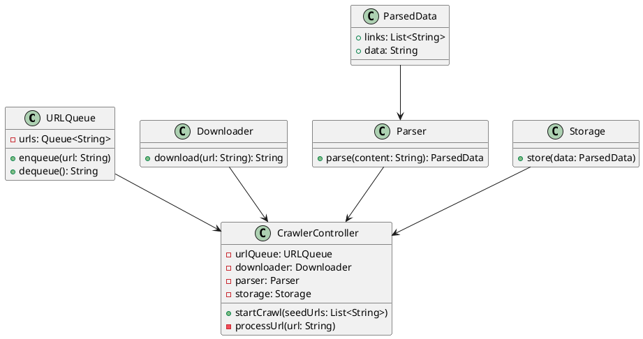
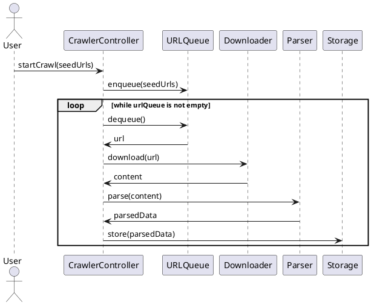

Sure! Let's break down the design of a web crawler and create the class and sequence diagrams using PlantUML.

### Web Crawler LLD

#### Requirements
1. **URL Queue**: Manage a queue of URLs to be crawled.
2. **Downloader**: Fetch the content of a URL.
3. **Parser**: Extract links and data from the content.
4. **Storage**: Store the extracted data.
5. **Controller**: Manage the crawling process, including multithreading.

#### Classes
1. **URLQueue**: Manages the queue of URLs.
2. **Downloader**: Downloads the content of a URL.
3. **Parser**: Parses the content to extract links and data.
4. **Storage**: Stores the extracted data.
5. **CrawlerController**: Manages the crawling process.

### Class Diagram (PlantUML)



### Sequence Diagram (PlantUML)



### Java Classes

#### URLQueue.java
```java
import java.util.LinkedList;
import java.util.Queue;

public class URLQueue {
    private Queue<String> urls = new LinkedList<>();

    public synchronized void enqueue(String url) {
        urls.add(url);
    }

    public synchronized String dequeue() {
        return urls.poll();
    }
}
```

#### Downloader.java
```java
import java.io.IOException;
import java.nio.charset.StandardCharsets;
import java.nio.file.Files;
import java.nio.file.Paths;

public class Downloader {
    public String download(String url) throws IOException {
        // Simulate download
        return new String(Files.readAllBytes(Paths.get(url)), StandardCharsets.UTF_8);
    }
}
```

#### Parser.java
```java
import java.util.ArrayList;
import java.util.List;

public class Parser {
    public ParsedData parse(String content) {
        // Simulate parsing
        ParsedData data = new ParsedData();
        data.links = new ArrayList<>();
        data.data = content;
        return data;
    }
}

class ParsedData {
    public List<String> links;
    public String data;
}
```

#### Storage.java
```java
public class Storage {
    public void store(ParsedData data) {
        // Simulate storage
        System.out.println("Stored data: " + data.data);
    }
}
```

#### CrawlerController.java
```java
import java.io.IOException;
import java.util.List;
import java.util.concurrent.ExecutorService;
import java.util.concurrent.Executors;

public class CrawlerController {
    private URLQueue urlQueue = new URLQueue();
    private Downloader downloader = new Downloader();
    private Parser parser = new Parser();
    private Storage storage = new Storage();
    private ExecutorService executorService = Executors.newFixedThreadPool(10);

    public void startCrawl(List<String> seedUrls) {
        for (String url : seedUrls) {
            urlQueue.enqueue(url);
        }

        for (int i = 0; i < 10; i++) {
            executorService.submit(() -> {
                while (true) {
                    String url = urlQueue.dequeue();
                    if (url == null) {
                        break;
                    }
                    try {
                        processUrl(url);
                    } catch (IOException e) {
                        e.printStackTrace();
                    }
                }
            });
        }

        executorService.shutdown();
    }

    private void processUrl(String url) throws IOException {
        String content = downloader.download(url);
        ParsedData parsedData = parser.parse(content);
        storage.store(parsedData);

        for (String link : parsedData.links) {
            urlQueue.enqueue(link);
        }
    }
}
```

These diagrams and classes provide a basic structure for a web crawler in Java. The `CrawlerController` manages the crawling process, including multithreading to handle multiple URLs concurrently. The `URLQueue`, `Downloader`, `Parser`, and `Storage` classes handle their respective tasks.